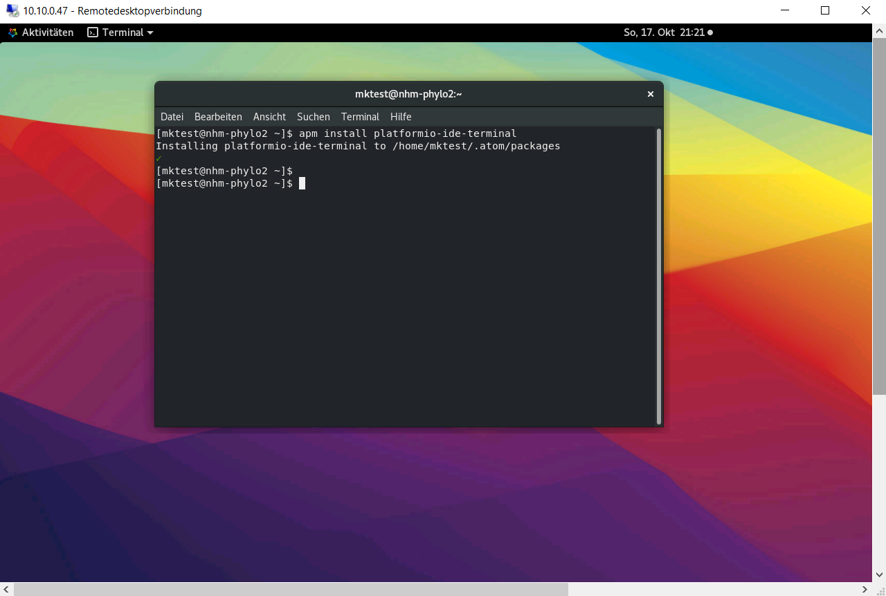

## This repository contains a very simple first-step tutorial on how to perform bioinformatic analyses on our phyloserver.

:warning:Be warned, we will dive deep into cryptozoology ;-) :warning:

### (a) Access via Remote Desktop

On your Windows computer, search for the "Remote Desktop" tool (see below)


enter the IP address for the phyloserver and use the username and password provided during the workshop. On the GNOME Desktop of the Server you can click on the "Aktivitäten" field to choose different installed programs, e.g. Terminal.


### (b) set up ATOM Text Editor

To start the Atom Editor, simply type `atom` in the Terminal


and the following window will appear


There are several options to adjust the appearance of the editor's window. Atom editor is famous for its ability to be tailored to user's requirement. To do that, follow the given steps. Click on the 'Edit' button in the menu bar and navigate to 'preferences'


and you will see the following screen


There, you can select themes and choose the "light" theme both for the user interface (UI)...


and also for the code syntax field.


#### install Platformio-ide-terminal

As a very first step, we are going to install the ESSENTIAL `Platformio-ide-terminal` pacakge, which adds a fully functioning terminal to your ATOM editor.

Go to your terminal and type

```bash
apm install plattformio-ide-terminal
```



The next time you open ATOM, you will find a `+` in the bottom left corner of the window.

Once you click on it, a new terminal window will appear at the bottom of the Atom Window.


While this is already cool, you can set a shortcut to automatically copy and excecute code from a text file in the terminal using the combination of the keys `'ctrl'+'enter'`

You need to open the Keymap file by clicking 'Edit' and choosing Keymap...


In the keymap.cson file, you need to add the following lines and save the file.

```bash
'atom-text-editor':
  'ctrl-enter': 'platformio-ide-terminal:insert-selected-text'
```


Then you need to restart Atom so that the shortcut becomes available. Now that we have a fully functioning text editor, it is time to start some real analyses

### (c) clone this GitHub repository

In your Atom editor, open a new terminal window by clicking the `+` in the bottom left corner and type the following

```bash
cd

git clone https://github.com/nhmvienna/MysteriousAbominableYeti
```

Now, you have imported all data from the 'MysteriousAbominableYeti' repository to your home directory.

### (d) Select project folders

By clicking `File > Add Project folder...` or by using the shortcut **'Ctrl'+'Shift'+'A'** you can now select the newly downloaded folder "MysteriousAbominableYeti" as your project folder.


Once the Project folder is loaded, it will appear in the left pane of the window.


### (e) Start the bioinformatic analyses

In Atom, open the document 'main.sh' located in the folder shell/ and follow the instructions.

You may need to adjust the wrapping of the text to improve the readibility. This can be done as follows


## Happy exploring
