# This repository contains a very simple first-step tutorial on how to perform bioinformatic analyses on our phyloserver.

-   The slides to this Workshop can be found [here](https://github.com/nhmvienna/FirstSteps/blob/main/resources/Workshop_Phyloserver2.pdf) (admission to NHM private repositories necessary)
-   The recordings of the Workshop can be found on the NHM intranet under `I:/Public/mkapun/FrontiersInMolecularSystematics/Workshop_I_Phyloserver`

### (a) Access via Remote Desktop

On your Windows computer, search for the "Remote Desktop" tool (see below)


enter the IP address for the phyloserver and use the username and password provided during the workshop. On the GNOME Desktop of the Server you can click on the "Aktivitäten" field to choose different installed programs, e.g. Terminal.


### (b) set up VSCode Text Editor

The VScode editor is our :switzerland: army knife for bioinformatics analyses. It is not only a tetxt editor, but also a terminal and an interface to communicate with GitHub. Needless to say that starting up VSCode Editor should be the first thing you do when starting your work on the server. To do so, simply type `code` in the Terminal.

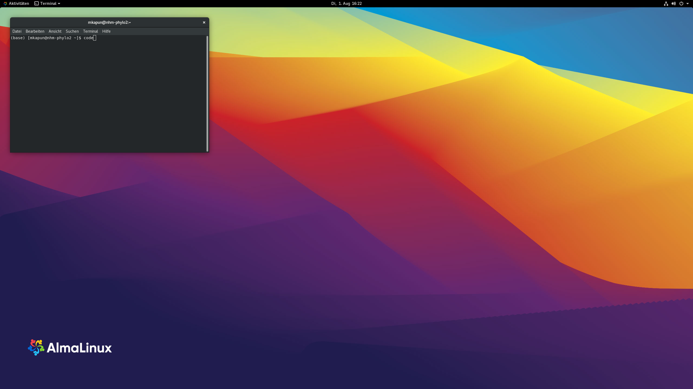

and the following window will appear

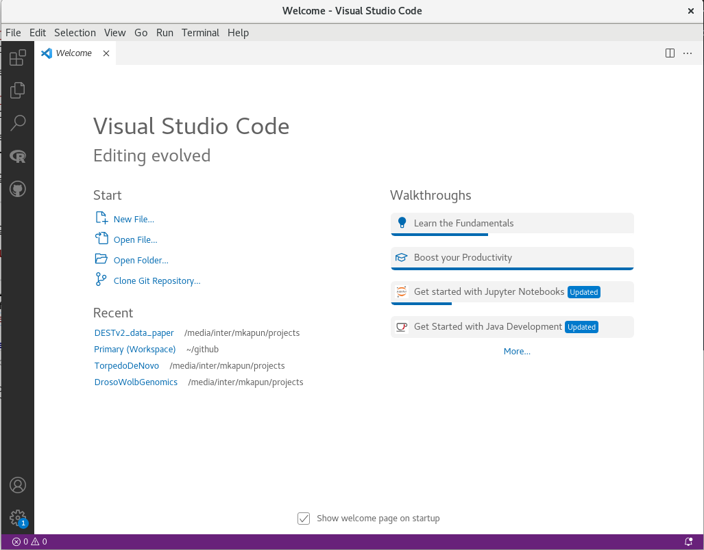

On the startup screen you will be first ask to enter a new password for the main keychain. I would use the same as for the login to keep things simple.

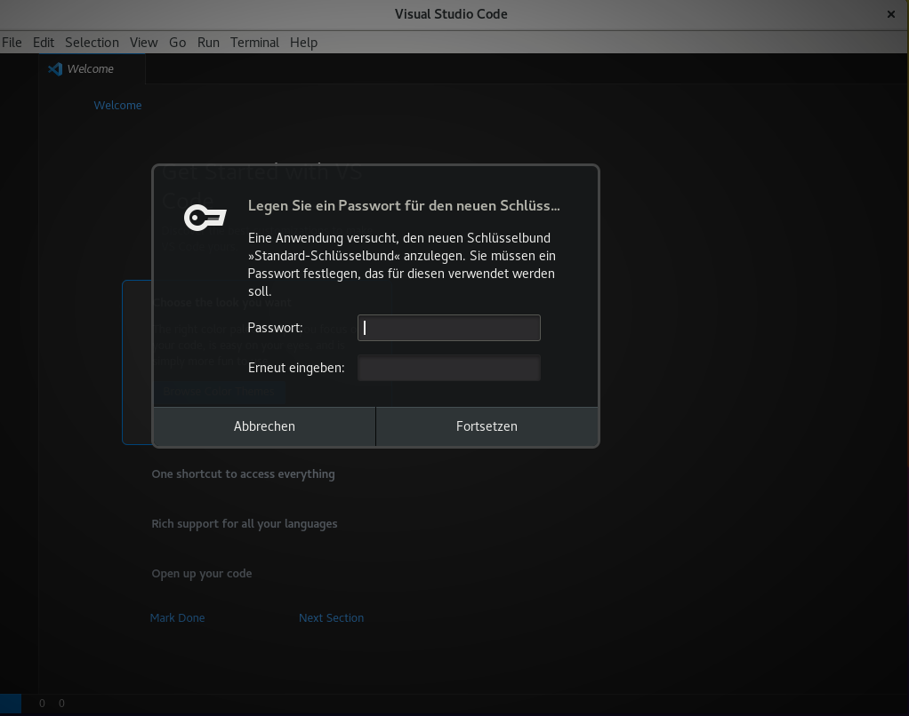

Then, VScode will show a Welcome Guide, which is very useful for the initial setup of VSCode.

VSCode editor is famous for its ability to be tailored to user's requirement. For example, you can easily change the theme of VSCode right here in the Welcome screen. Or you can to this also later by choosing `File -> Preferences -> Settings`, or more simply, by clicking `Ctrl+,`.

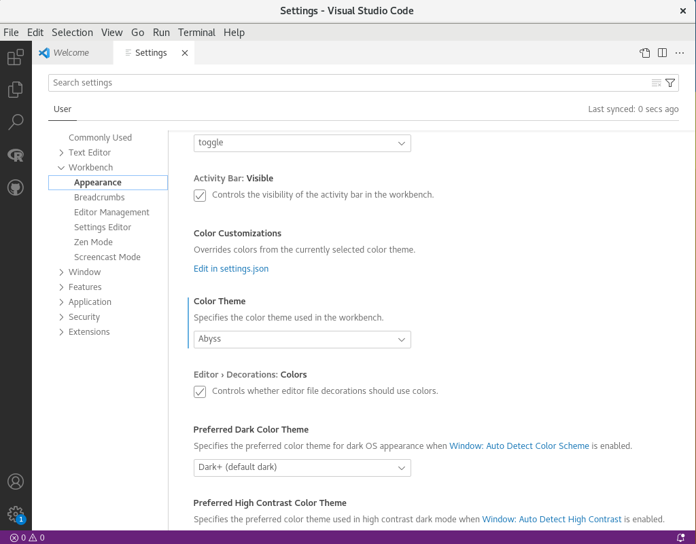

Another powerful feature is the tight integration of GitHub, which, for example, allows you to sync your settings across different computers (where you are logged into VScode with the same GitHub account). In the Welcome Screen you can turn on syncing and logging into Github by choosing `Enable Settings Sync` and then `Sign in & Turn on` and then follow the instructions in the browser. Note, that GitHub demands two-factor authentification. Thus, you may need to set this up beforehands.

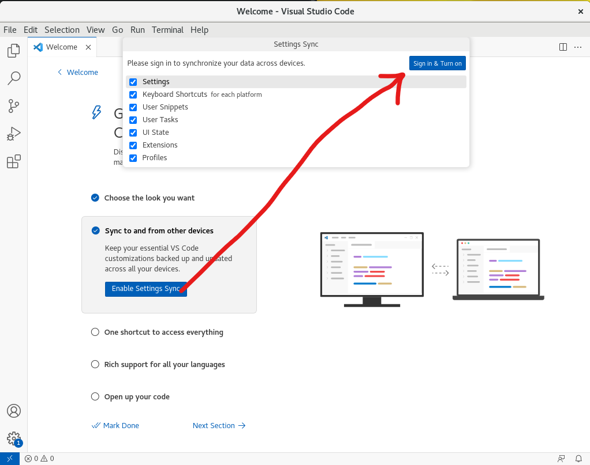

### (c) set up shortcut to automatically copy and excecute code from a text file in the terminal using the combination of the keys `'ctrl'+'enter'`

You need to open the Keymap file by clicking ``Ctrl+Shift+p``. Then type "Key" and choose "Preferences: Open Keyboard Shortcuts"

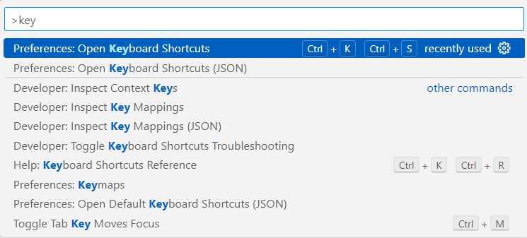

In the new window, type "runse" and choose "Terminal: Run Selected Text in Active Terminal". If no keybinding exist you, can click in the empty field left to the Command column and a new window will appear, where you can use your desired Key-Combination to execute. I use, for example "Ctrl+Enter".

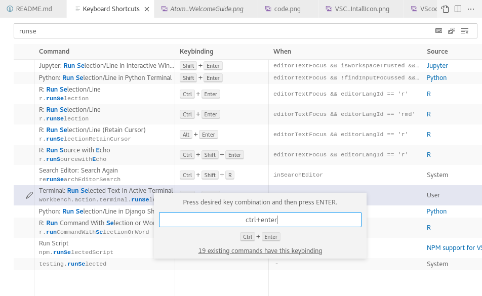

### (c) clone this GitHub repository

In your VSCode editor, open a new terminal window by the "Terminal"  tab in the menu bar at the top. 

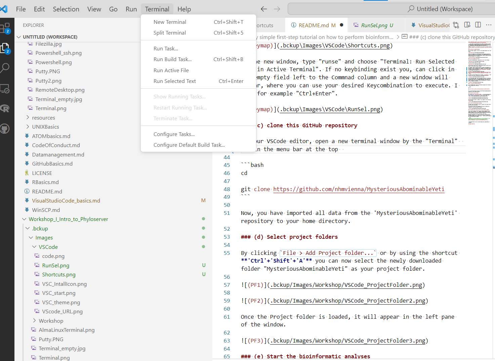

and paste the below code in the terminal window

```bash
cd

git clone https://github.com/nhmvienna/Workshop_I_Intro_to_Phyloserver
```

Now, you have imported all data from the 'Workshop_I_Intro_to_Phyloserver' repository to your home directory.

### (d) Select project folders

By clicking `File > Add Project folder...`  you can now select the newly downloaded folder "Workshop_I_Intro_to_Phyloserver" from your home directory as your project folder.

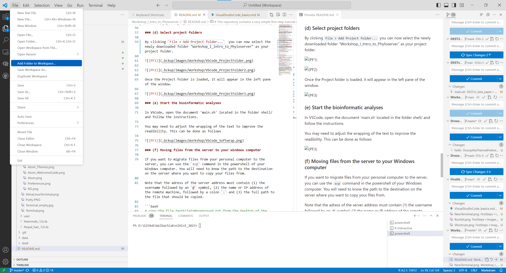

Once the Project folder is loaded, it will appear in the left pane of the window.

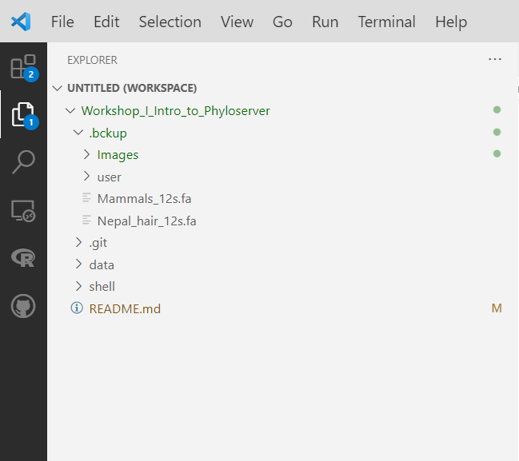

### (e) Start the bioinformatic analyses

In VSCode, open the document 'main.sh' located in the folder 'shell/' and follow the instructions.

You may need to adjust the wrapping of the text to improve the readibility. This can be done by clicking `View -> Word Wrap` in the menu bar

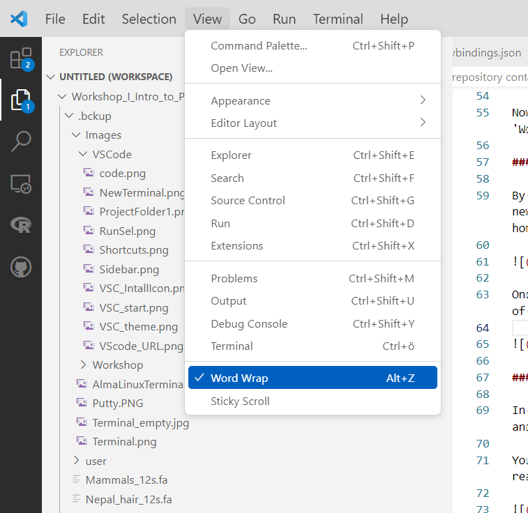

### (f) upload the folder as a new GitHub repository

One fantastic feature to backup your code and to collaborate is to save your software project in the cloud using GitHub. By looking at the Workshop_1_Intro_to_Phyloserver repsitory, you can already get an idea how, even big bioinformatics projects can be documented and shared. To test this functionality, we will now modify the Workshop_1_* folder, just downloaded from the NHM GitHub page and upload a modified version to our own private GitHub account. 

##### (1) copy and rename the folder

To distinguish the folder from the original GitHub repository, we will first make a copy and use a new name. We have to add `-r` since we are copying a whole folder and not just a file.

```bash
cp -r ~/Workshop_I_Intro_to_Phyloserver ~/YetiIsGreat
```
After that, you will need to add the new working folder 'YetiIsGreat' to the workspace via `File->Add Folder to Workspace...`

##### (2) remove the .git/ folder which contains the original GitHub info

All the version control, which allows to recapitulate what has been changed in each version is stored in this folder. To start from scratch, we need to delete it.

```bash
rm -rf ~/YetiIsGreat/.git
```

##### (3) add .gitignore file

Another powerful feature of GitHub is that you can control which files/folder should be synchronized. Note, for example, that no files bigger than 100mb can be uploaded (and there might be a file limit, but I am not fully sure). Thus, we want to ignore the data folder which may contain large files. Using the `echo` command we write the path to the data/ folder to a new .gitignore file.

```bash
echo 'data/' > ~/YetiIsGreat/.gitignore
```
##### (4) synchronize folder to GitHub

You first need to add your email and Name to the GitHub configuration to set up the synchronization. Therefore type the following:

```bash
git config --global user.email "<email>"
git config --global user.name "<FirstName LastName>"
```
and replace `<email>` with your email that you use for the GitHub login and `<FirstName LastName>` with your full name.

Now it is time to sync the folder to GitHub. Therefore, open up the command palette with `SHIFT+strg+p` (or `SHIFT+ctrl+p`) and type `publ` and choose 'Publish to GitHub', choose the working folder and select as 'private' (for now). 

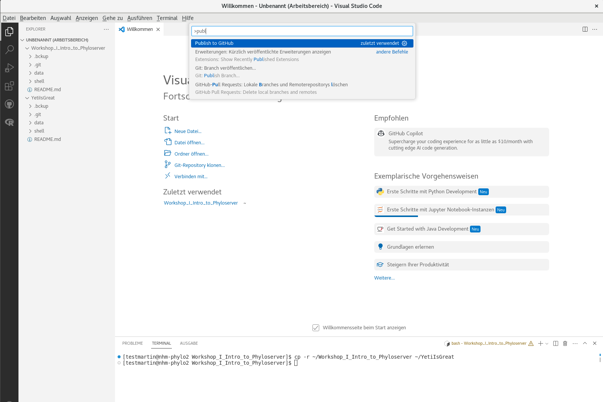

To show the right sidebar in VScode, which allows to communicate with GitHub, press `alt+strg+b`

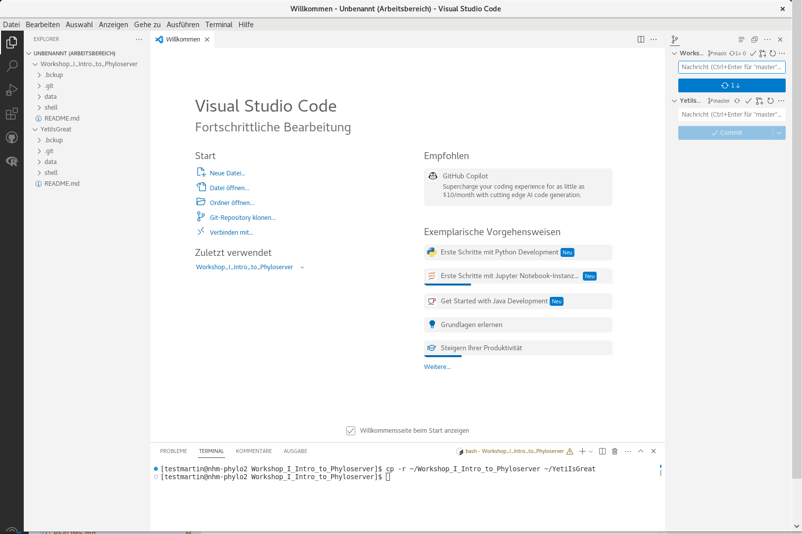

If everything worked fine, you should now see your new YetiIsGreat GitHub Repository in the sidebar. You will see that the new files appear and to upload and sync everthing to Github you need to add a message, e.g. "upload" and press `commit`, to freeze your changes and make the files ready for sync. Then, you can press `publish` to upload all files.

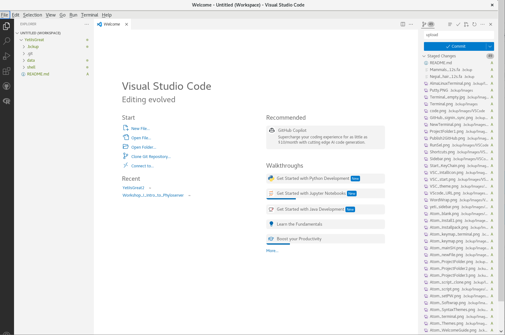

Now you should also see it in the browser under `https://github.com/<username>/YetiIsGreat`, where `<username>` is your GitHub username.

##### (5) update folder to GitHub

Finally, we want to test if the syncing indeed works. We thus creat a new file.

```bash
echo '## My Repo :heart:' > ~/YetiIsGreat/Test.md
```
In the sidebar, you will see that the new file appears, now you need to add a message, e.g. "upload" and press `commit`, to freeze your changes and make the file ready for sync.

Now press the "Sync Changes" button submit the changes to GitHub.

:caution: If the Repository is actively maintained by many people, make sure to update the local copy of your repository by pressing the  symbol before making any changes. Otherwise, you will run into version conflicts, which might be tricky to resolve. :caution:

### (f) Moving files from the server to your Windows computer

If you want to migrate files from your personal computer to the server, you can use the `scp` command in the powershell of your Windows computer. You will need to know the path to the destination on the server where you want to copy your files from.

Note that the adress of the server address must contain (1) the username followed by an `@` symbol, (2) the name or IP address of the remote machine, followed by a colon `:` and (3) the full path to the file that should be copied.

```bash
# copy the file TestFileToMoveAround.txt from the Desktop of the remote machine to the H:/ drive on your Windows machine
scp <username>@<IP>:~/Desktop/TestFileToMoveAround.txt H:/
```

Alternatively you can also use [WinSCP](https://github.com/nhmvienna/FirstSteps/blob/main/Bioinformatics/Phyloserver.md#2-via-winscp)

:warning:Be warned, we will now dive deep into cryptozoology ;-) :warning:

## Happy exploring
