## This repository contains a very simple first-step tutorial on how to perform bioinformatic analyses on our phyloserver.

-   The slides to this Workshop can be found [here](https://github.com/nhmvienna/FirstSteps/blob/main/resources/Workshop_Phyloserver2.pdf)
-   The recordings of the Workshop can be found on the NHM intranet under `I:\Public\mkapun\FrontiersInMolecularSystematics\Workshop_I_Phyloserver`

### (a) Access via Remote Desktop

On your Windows computer, search for the "Remote Desktop" tool (see below)

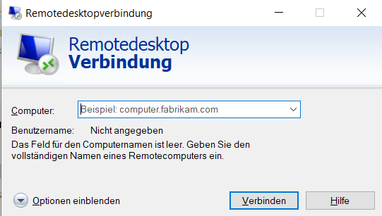

enter the IP address for the phyloserver and use the username and password provided during the workshop. On the GNOME Desktop of the Server you can click on the "Aktivitäten" field to choose different installed programs, e.g. Terminal.

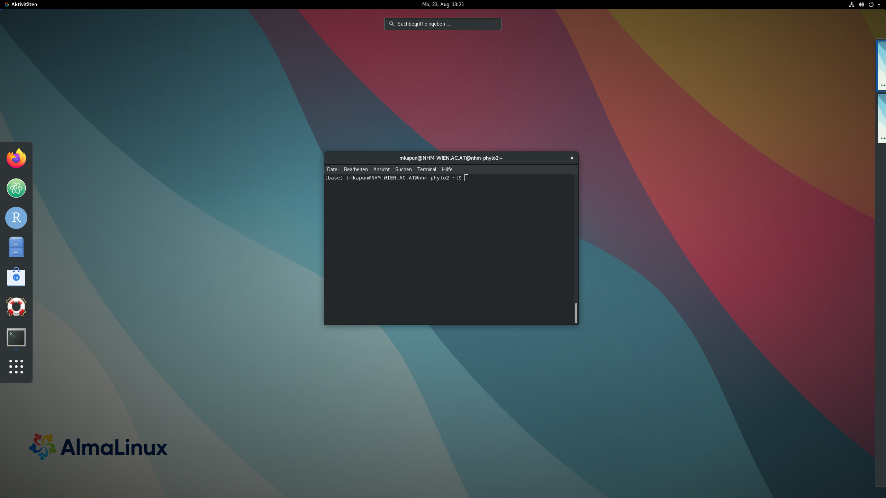

### (b) set up ATOM Text Editor

To start the Atom Editor, simply type `atom` in the Terminal


and the following window will appear

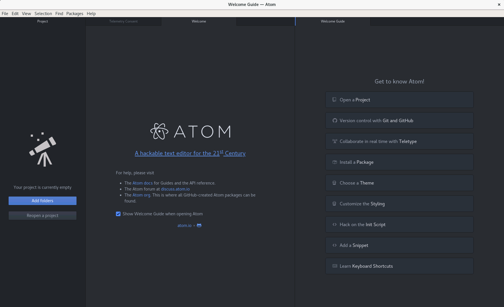

as a very first task, you will need to set a password for the keychain.

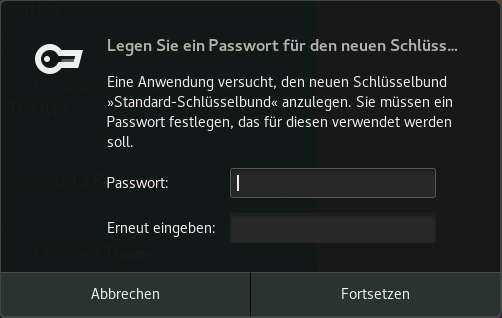

On the startup screen you will find a Welcome Guide, which is very useful for the initial setup of Atom.

For example, there are several options to adjust the appearance of the editor's window. Atom editor is famous for its ability to be tailored to user's requirement. For example, you can easily change the theme of Atom by clicking on the "Theme" button.

An new settings tab will appear, where you can select themes and choose the "light" theme both for the user interface (UI)...

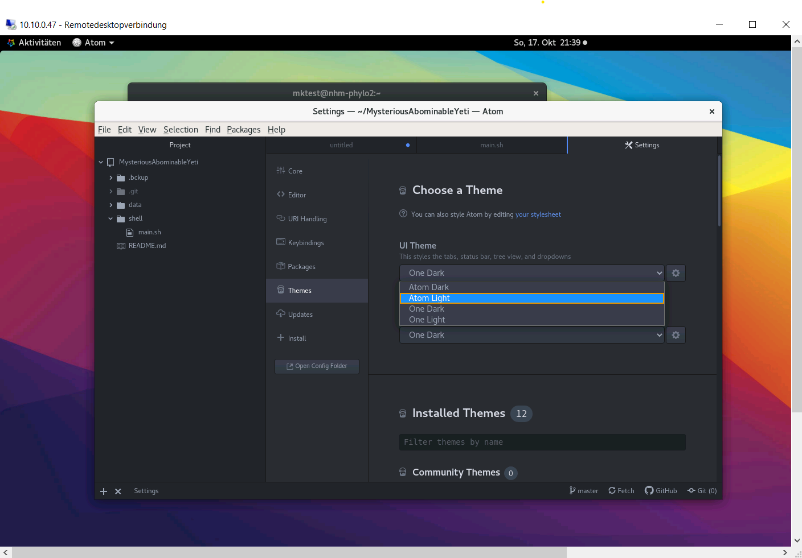

and also for the code syntax field.

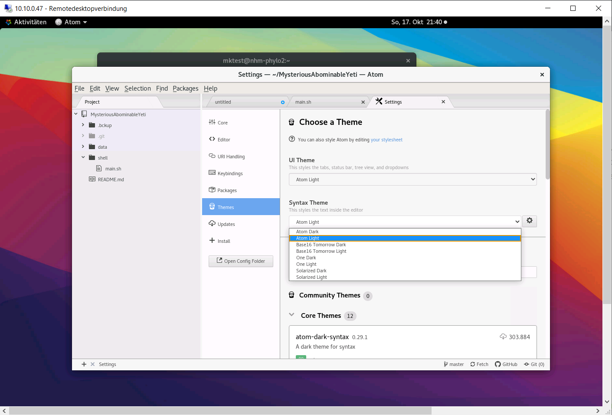

#### install Platformio-ide-terminal

As a very first step, we are going to install the ESSENTIAL `Platformio-ide-terminal` pacakge, which adds a fully functioning terminal to your ATOM editor. On the Welcome Guide, which should be still opened, you can find the button "Install a Packages". Press on it and the settings window will appear. There you can type "plattformio-ide-terminal" in the search field and install the corresponding package.

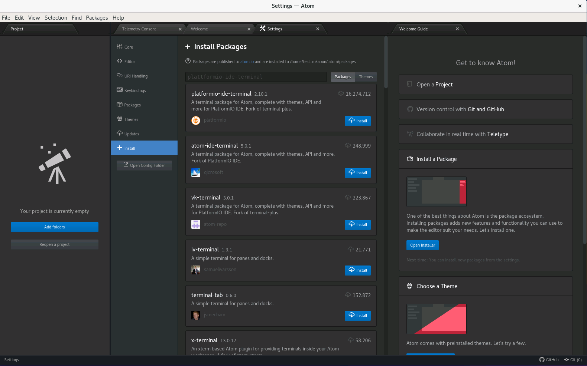

When the installation is completed, you will find a `+` in the bottom left corner of the window. Once you click on it, a new terminal window will appear at the bottom of the Atom Window.

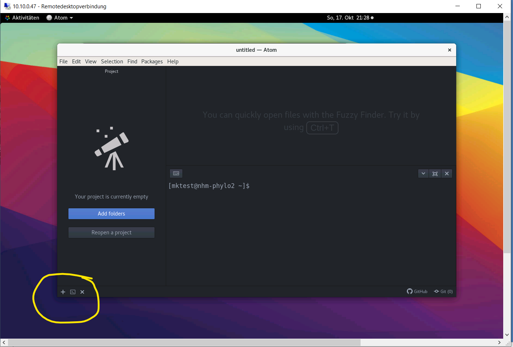

While this is already cool, you can set a shortcut to automatically copy and excecute code from a text file in the terminal using the combination of the keys `'ctrl'+'enter'`

You need to open the Keymap file by clicking 'Edit' and choosing Keymap...

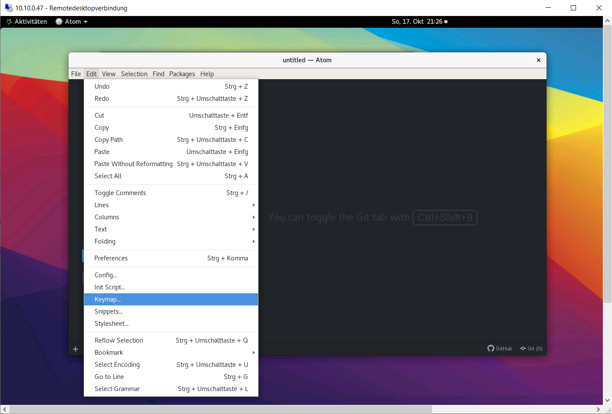

In the keymap.cson file, you need to add the following lines and save the file.

```bash
'atom-text-editor':
  'ctrl-enter': 'platformio-ide-terminal:insert-selected-text'
```

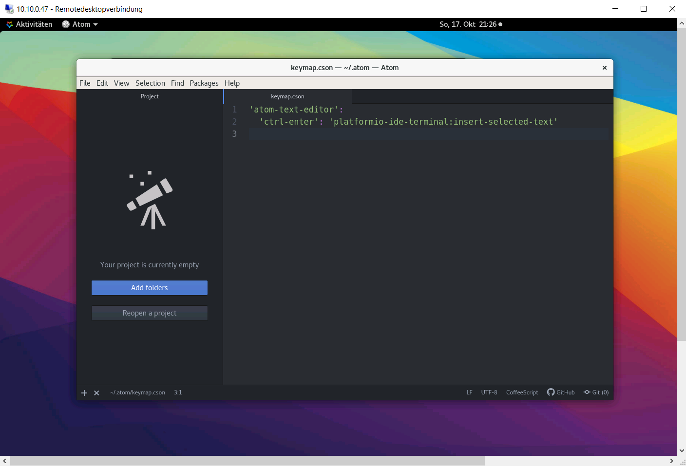

Then you need to restart Atom so that the shortcut becomes available. Now that we have a fully functioning text editor, it is time to start some real analyses

### (c) clone this GitHub repository

In your Atom editor, open a new terminal window by clicking the `+` in the bottom left corner and type the following

```bash
cd

git clone https://github.com/nhmvienna/MysteriousAbominableYeti
```

Now, you have imported all data from the 'MysteriousAbominableYeti' repository to your home directory.

### (d) Select project folders

By clicking `File > Add Project folder...` or by using the shortcut **'Ctrl'+'Shift'+'A'** you can now select the newly downloaded folder "MysteriousAbominableYeti" as your project folder.

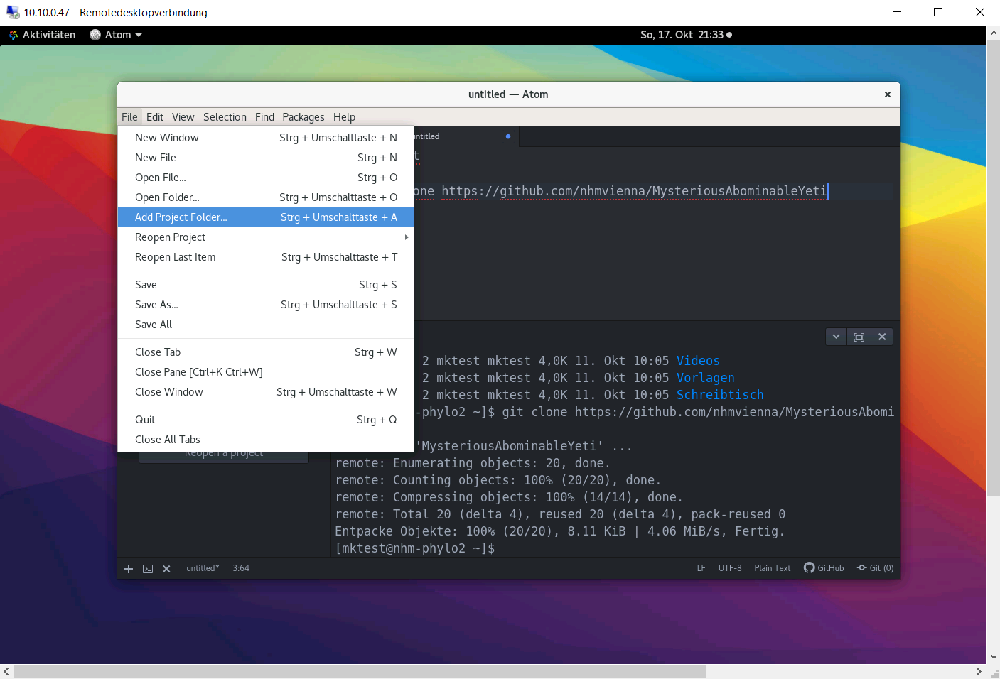

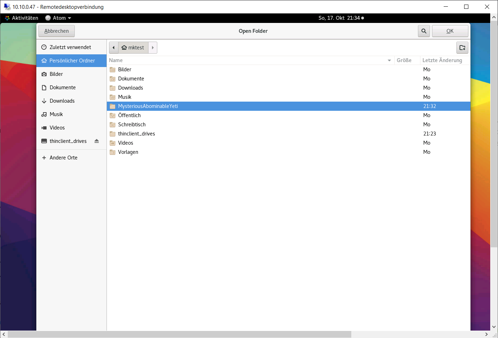

Once the Project folder is loaded, it will appear in the left pane of the window.

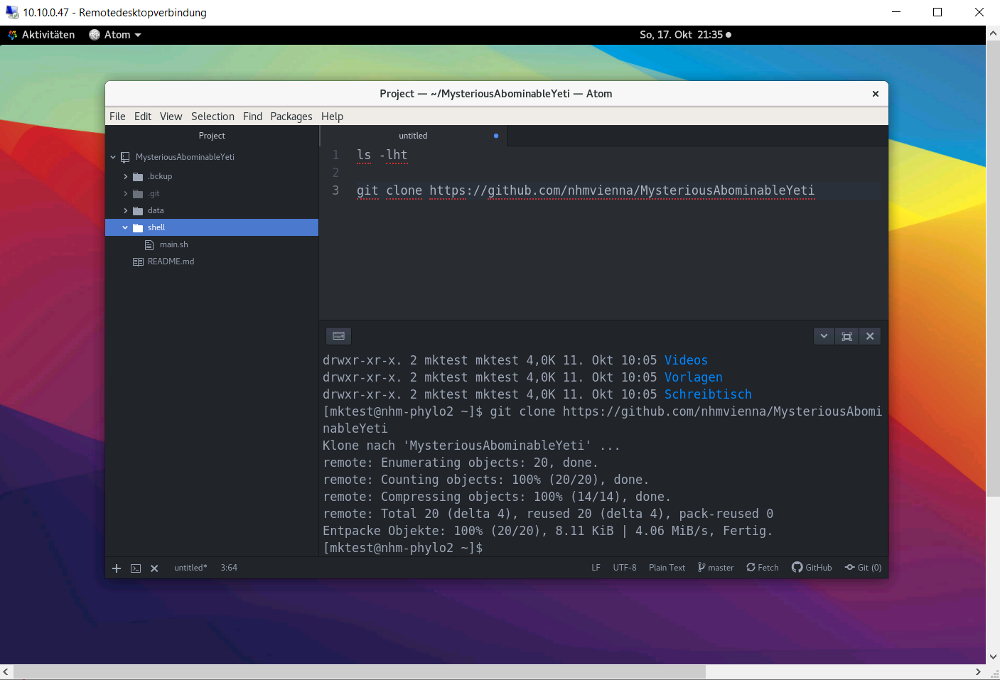

### (e) Start the bioinformatic analyses

In Atom, open the document 'main.sh' located in the folder shell/ and follow the instructions.

You may need to adjust the wrapping of the text to improve the readibility. This can be done as follows

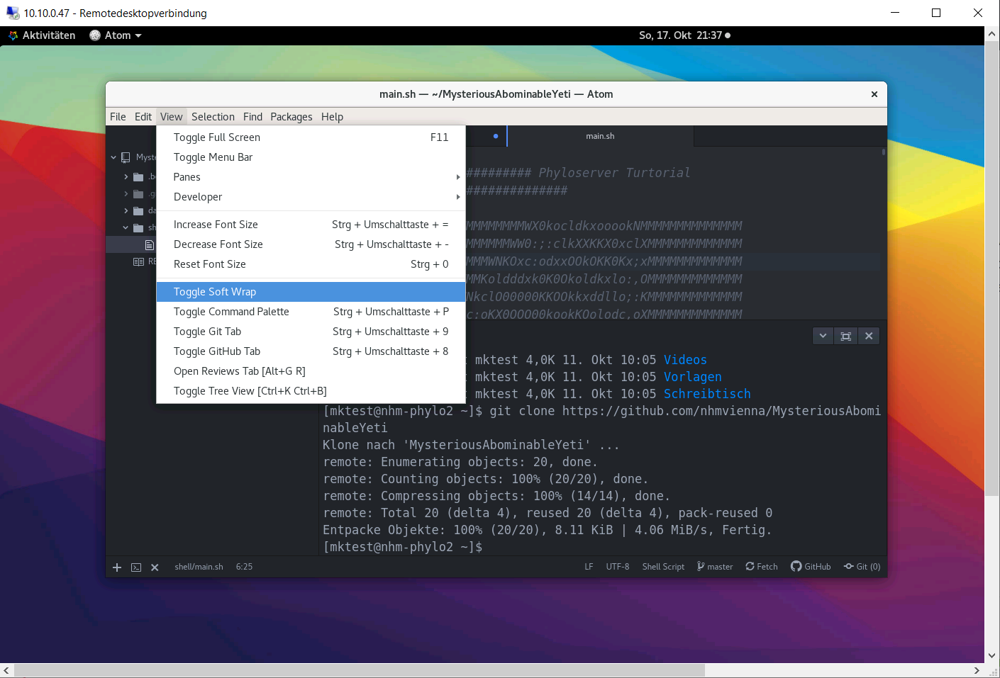

### (f) Moving files from the server to your Windows computer

If you want to migrate files from your personal computer to the server, you can use the `scp` command in the powershell of your Windows computer. You will need to know the path to the destination on the server where you want to copy your files from.

Note that the adress of the server address must contain (1) the username followed by an `@` symbol, (2) the name or IP address of the remote machine, followed by a colon `:` and (3) the full path to the file that should be copied.

```bash
# copy the file TestFileToMoveAround.txt from the Desktop of the remote machine to the H:\ drive on your Windows machine
scp <username>@<IP>:~/Desktop/TestFileToMoveAround.txt H:\
```

:warning:Be warned, we will now dive deep into cryptozoology ;-) :warning:

## Happy exploring
